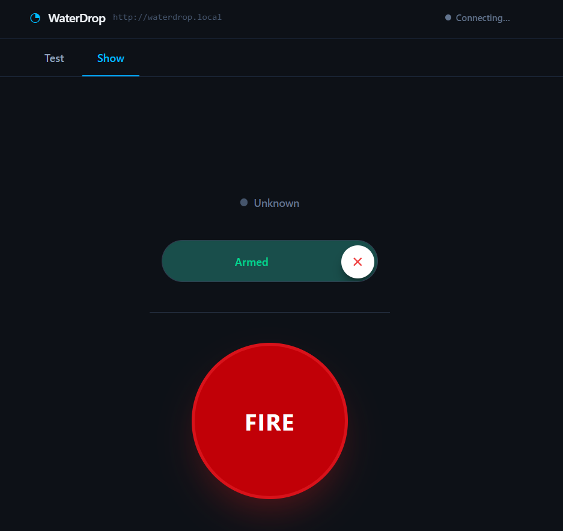

# 💧 WaterDrop Web

A modern web interface for controlling your WaterDrop device. Built with React, TypeScript, and Vite.


## What is this?

WaterDrop Web is a simple web app that lets you control a WaterDrop device from your browser. It has two modes:
- **Test Mode**: Try out individual water drop actions
- **Show Mode**: Run automated water drop shows

## 🚀 Getting Started (Super Easy!)

Follow these steps to get the app running on your computer:

### Step 1: Install Node.js

Node.js is like a toolbox that helps run the app. You only need to install it once!

1. Go to [https://nodejs.org](https://nodejs.org)
2. Download the **LTS** version (the one that says "Recommended for most users")
3. Run the installer and click "Next" until it's done
4. To check it worked, open a terminal/command prompt and type:
   ```bash
   node --version
   ```
   You should see a version number like `v20.x.x`

### Step 2: Download the Code

1. Download this project as a ZIP file (or use `git clone` if you know how)
2. Unzip it somewhere easy to find (like your Documents or Desktop folder)

### Step 3: Open a Terminal

- **Windows**: Right-click inside the project folder and choose "Open in Terminal" or press `Win + R`, type `cmd`, and press Enter
- **Mac**: Right-click the folder and choose "New Terminal at Folder"
- **Linux**: Right-click and choose "Open Terminal Here"

### Step 4: Install Project Dependencies

Type this command and press Enter:

```bash
npm install
```

This downloads all the tools the app needs (like React and Vite). It takes about 1-2 minutes.

### Step 5: Start the App

Type this command and press Enter:

```bash
npm run dev
```

You should see something like:
```
  VITE v8.0.0  ready in 500 ms

  ➜  Local:   http://localhost:5173/
```

### Step 6: Open in Your Browser

1. Open your web browser (Chrome, Firefox, Safari, etc.)
2. Go to: `http://localhost:5173`
3. You should see the WaterDrop interface! 🎉

## 🛠️ Available Commands

Once you have everything set up, here are the commands you can use:

- `npm run dev` - Start the app for development (hot reload enabled)
- `npm run build` - Build the app for production
- `npm run preview` - Preview the production build
- `npm run lint` - Check code for errors

## 📝 Configuration

The app connects to your WaterDrop device using an API. By default, it looks for the device at `http://localhost:3000`.

To change this, edit the `src/config.ts` file.

## 🧰 What's Inside?

This project uses:
- **React** - A library for building user interfaces
- **TypeScript** - JavaScript with type safety
- **Vite** - A super fast build tool
- **Tailwind CSS** - For styling the app
- **Sonner** - For toast notifications

## 🆘 Troubleshooting

**Problem**: `npm: command not found`
- **Solution**: Node.js isn't installed or isn't in your PATH. Reinstall Node.js from the official website.

**Problem**: Port 5173 is already in use
- **Solution**: Close any other apps running on that port, or change the port in `vite.config.ts`

**Problem**: The app loads but shows "disconnected"
- **Solution**: Make sure your WaterDrop device/server is running and accessible at the API URL

## 📄 License

This project is licensed under the MIT License - see the [LICENSE](LICENSE) file for details.

## 🤝 Contributing

Contributions are welcome! Feel free to open issues or submit pull requests.

## 📸 Screenshot


